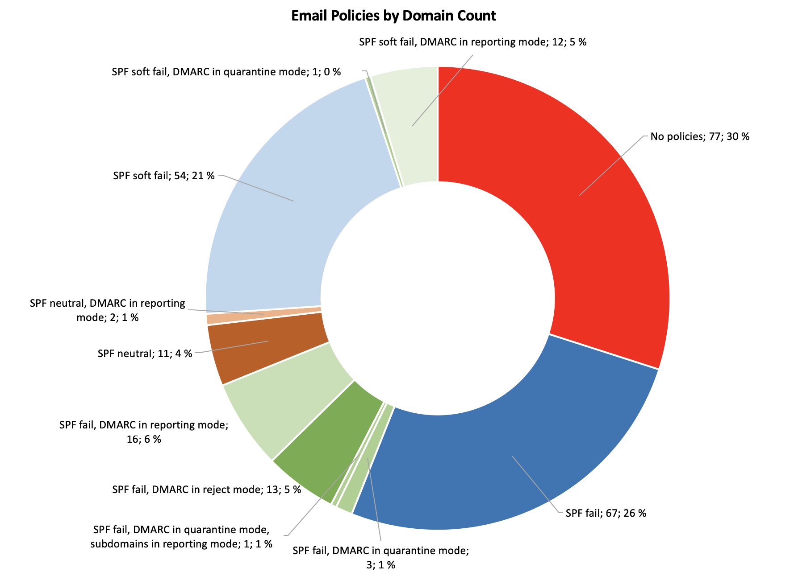

I took the Friday after the independence day free and apparently I didn't have anything else to do, except to study SPF, DKIM, and DMARC. These are methods for senders to provide authentication for the sent emails to aid spam filters in detecting spoof attempts, with SPF and DKIM being a little bit older and more established, and DMARC being a newer method for communicating policy, building on the foundation of the other two. Together these methods provide companies methods to protect their brands against malicious parties spoofing their email addresses.

I ended up reading an interesting research paper by Hang Hu and Gang Wang from Virginia Tech titled [End-to-End Measurements of Email Spoofing Attacks](https://people.cs.vt.edu/gangwang/usenix-draft.pdf). The researchers found out that the SPF adoption rate for the 1000 most popular sites in Alexa list was in the beginning of 2018 about 73% and 31 out of 35 large email service providers, like gmail.com and hotmail.com, actively use SPF in their spam filtering. For DMARC the adoption rate was 41% and 16 out of the 35 email services used it in spam filtering. Their research also shows that the rate of spoof emails, that reached the users' inboxes in their tests, reduced significantly when a domain had a DMARC "p=reject" policy when compared to a domain with only SPF/DKIM in use, and for domains with neither SPF, DKIM, nor DMARC authentication, the spoofed emails almost always reached the users' inboxes.

This made me wonder what the adoption rate is in Finnish companies, so I decided to do some digging. I pulled [a list of listed companies in the Helsinki Stock Exchange from Wikipedia](https://fi.wikipedia.org/wiki/Luettelo_Helsingin_p%C3%B6rssiss%C3%A4_noteeratuista_yhti%C3%B6ist%C3%A4), added a few that I had a personal interest to, and proceeded to create a list of domains that these companies were using. I worked under the assumption that the companies would be using either .fi or .com top level domains and soon I had a verified list of 134 companies with 257 domains to check. I did not find every existing domain for each company, but only added the ones that were apparent through browser redirects when accessing the .fi and .com domains for each company, or I added up to four additional domains when they were readily available through the front page of the company website. This failure to include all domains makes the data somewhat skewed, but I believe it is enough to make some assumptions. Then I wrote a small script to query the public SPF and DMARC records for those domains and collected the data in an excel sheet to analyze the published policies in the records. All data was gathered on 9 December 2018.

An SPF record usually declares one of three different policies; FAIL, discard the message if it fails the SPF check, SOFTFAIL, asks the receiver not to discard the message but to do some more checks if it doesn't pass the SPF check, or NEUTRAL, no policy.

A DMARC policy can be "p=none", used for monitoring when the sending domain isn't declaring a policy, but wishes to receive the DMARC reports from the receivers, "p=quarantine", requests the receiver to label any message, that doesn't pass the DMARC defined authentication as "SPAM", or "p=reject", which asks the receiver to discard any message that doesn't pass the authentication.

The below pie chart visualizes the usage of SPF and DMARC in the 257 domains. The red color includes the domains with no published SPF or DMARC records or with a "NEUTRAL" SPF policy. The yellow color includes the domains with an SPF FAIL or SOFT FAIL policy but no DMARC records, the light green color includes the domains with any SPF records and a DMARC monitoring policy enabling the administrators to get aggregate statistics reports through the DMARC protocol, and the green color includes the domains with "p=quarantine" and "p=reject" policies.

This indicates that:

- 34% of the checked domains have no authentication in place to protect their reputation against someone sending spoof emails in their name,
- 47% trust in only SPF FAIL or SOFT FAIL policies,
- 12% are in the process of deploying DMARC by having set up DMARC monitoring with a "p=none" policy,
- 7% are already declaring "p=quarantine" or p="reject" policies.

For the interested, I also have a more detailed pie chart with resolution to the deployed SPF and DMARC modes.

The above charts include all of the domains as one data set, but they don't tie the data to the specific companies. Each company has up to five domains in the list and each domain needs to have it's own specific SPF and DMARC policies. Below, I have divided the companies into six groups as follows. I'm naming a few companies with impressive setups, but I'm not publishing the whole lists. This is all easily accessible public data. Let the script-kiddies do some work if they want to find the easy targets.

**DMARC in use in all checked domains**

8% of the companies have deployed DMARC on all of the checked domains. These include companies like Danske Bank, Handelsbanken, Nordea, Outokumpu, Wärtsilä, and YIT.

These companies clearly are at the bleeding edge in their battle against spam and have comprehensive setups to protect all of their domains against being spoofed. I especially liked how Danske Bank, Outokumpu, and Wärtsilä have created their DMARC records by creating their own subdomains for DMARC and then making their various _dmarc subdomains CNAME records and pointing them to the one common DMARC record. Very elegant and easy to maintain!

Danske Bank was also the only one in the list who had all of the checked domains in "p=reject; aspf=s; adkim=s" mode, which means strict SPF and strict DKIM policy, with hard reject for all messages that are out of alignment. Hats off!

**DMARC used, but also has domains with only SPF**

With 7% share of the list, these companies seem to have their main domain, that they use for their email activities, set up for DMARC, usually in reporting mode, but otherwise rely on SPF policies for the rest of their domains. These companies are cleary testing DMARC out and planning the deployment.

**DMARC used, but also has domains with no policies**

With 11% share, these companies have DMARC set up for their main domain, but they seem to have forgotten to protect the rest of their domains. Sometimes the company mainly uses their company.com address, but does not protect the company.fi address, making it possible for someone to easily spoof a @company.fi address. This list includes big international technology companies.

**Only SPF in use in all checked domains**

37% of the companies have deployed SPF records for all of their checked domains, but seemingly haven't yet began testing with DMARC. Surprisingly this list also includes a hard core cyber security company or two!

**SPF used, but also has domains with no policies**

20% of the comanies also rely on SPF records, but have domains, that they haven't set up any policies for. Probably also for having forgotten it for the ones that aren't used for sending or receiving emails and this renders those domains vulnerable for being spoofed. This list also has a couple of surprising IT companies.

**No DMARC or SPF in use on any checked domains**

17% of the companies don't have any SPF or DMARC records for any of the checked domains, or had set the SPF records with NEUTRAL policies, which is a declaration of no policy. This list has some big international companies, that I would expect not to be strangers to the problems of phishing and spoofing, so the complete lack of SPF or DMARC records strikes me ass odd.

**What to take away from this?**

There is lots of work to do!

The need for consistency is the main take-away from this. 52% of the companies are using some form of email authentication on all of their domains, of which only 8% are truly bleeding edge, by having consistently deployed DMARC in a non reporting mode on all of their domains, other 7% are on their way getting there, and the rest 37% haven't began setting up DMARC yet. 31% are in need of an inventory of their domains and a project to set up consistent authentication on them for only having DMARC and/or SPF set up for their main domain but not for the rest, and 17% are in dire need begin to study the subject soon, for not having any authentication for even their main site and only relying on the guessing abilities of the receiving systems for spoofing detection.

The second is the elegant way, employed by Danske Bank, Outokumpu, and Wärtsilä, of consolidating the DMARC policies to one record and pointing to it with CNAME records.

My call to action is for us all to make the pie charts completely green. I'm certainly taking these lessons to heart when setting up authentication for my emails but I realize that deploying DMARC for a sprawling infrastructure can be a challenging project. However DMARC reporting provides a great tool for monitoring the state of the system and makes it possible to get near-instant feedback of the effects of the changes that you make, paving the way towards the strict "p=reject" policies. This ultimate goal will definitely make spoofing legit domains harder for the adversaries, when the technology gains wider use, and helps companies protect their brands against spoofing. 

